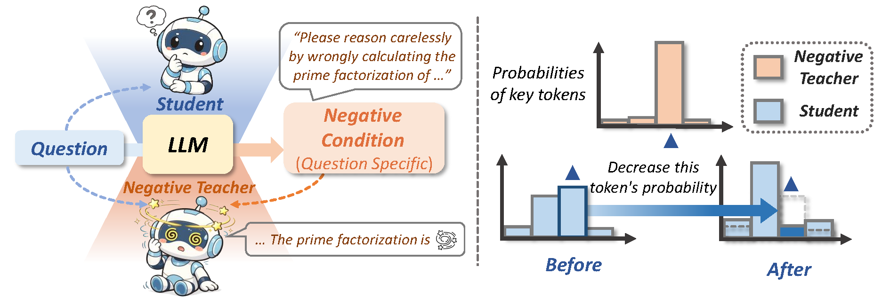

# Negative Self-Distillation (NSD)

[](https://huggingface.co/collections/PassionPrc/nsd-negative-self-distillation)

## Table of Contents

- [Overview](#overview)
- [Model Checkpoints](#model-checkpoints)
- [Quick Start](#quick-start)
  - [Requirements](#requirements)
  - [Install](#install)
  - [Key Versions](#key-versions)
  - [Environment Variables](#environment-variables)
- [Repository Structure](#repository-structure)
- [Training](#training)
  - [Step 1 — Generate Negative Conditions](#step-1--generate-negative-conditions)
  - [Step 2 — Train](#step-2--train)
  - [Step 3 — Evaluate](#step-3--evaluate)

---

## Overview

This is the official github repo of paper "Negative Self-Distillation: Learning to\\Reason by Avoiding Flaws".


*Overview of NSD.*

NSD improves LLM math reasoning robustness by training the model to resist adversarial reasoning errors — **without requiring ground-truth labels**.

The key idea: for each training problem, we generate a "negative condition" designed to steer the model toward a wrong reasoning path. We then run the model twice — once normally (reference) and once with the negative condition (negative teacher) — and train the student to suppress tokens where the negative teacher diverges from the reference.

**Loss:**
```
L = β · KL(student ∥ ref) + α · max(0, π_atk − π_ref) · unlikelihood(π_student)
```
- **KL term**: keeps the student anchored to the reference (prevents drift)
- **Push term**: divergence-gated unlikelihood — only penalizes tokens that the negative teacher over-assigns relative to reference

**Negative conditioning variants supported:**
- *Question-only (blind)* — LLM-generated negative condition, without seeing the solution
- *Sol-aware* — LLM-generated negative condition, conditioned on the solution
- *Wiki-irr* — inject a random Wikipedia article as irrelevant context ([source](https://arxiv.org/abs/2504.02111))
- *Sol-aware online* — negative conditions generated on-the-fly each training step

**Training modes:**
- *Policy Gradient* — NSD loss as negative reward, optimized via GRPO
- *Supervised Distillation* — NSD loss backpropagated directly (forward KL + trust-region clip)

The core NSD loss is implemented in `verl/verl/trainer/distillation/losses.py` (loss modes: `divergence_gated`, `divergence_gated_log`, `divergence_gated_sigmoid`).

---

## Model Checkpoints

Trained NSD checkpoints are available on HuggingFace:

**[PassionPrc/nsd-negative-self-distillation](https://huggingface.co/collections/PassionPrc/nsd-negative-self-distillation)**

---

## Quick Start

### Requirements

- Python 3.10
- CUDA 12.9
- 8× A100 80GB for training (2× minimum)

### Install

```bash
# 1. Create conda environment
conda create -n nsd python=3.10 -y
conda activate nsd

# 2. PyTorch (CUDA 12.9)
pip install torch==2.8.0 --index-url https://download.pytorch.org/whl/cu129

# 3. vLLM
pip install vllm==0.11.0

# 4. Ray
pip install ray==2.55.1

# 5. verl — use the modified version in this repo (contains NSD losses)
cd verl && pip install -e . && cd ..

# 6. flash-attn
pip install flash-attn==2.8.3 --no-build-isolation

# 7. Other dependencies
pip install -r requirements.txt
```

### Key Versions

| Package | Version |
|---|---|
| Python | 3.10 |
| PyTorch | 2.8.0+cu129 |
| CUDA | 12.9 |
| vLLM | 0.11.0 |
| Ray | 2.55.1 |
| transformers | 4.57.6 |
| flash-attn | 2.8.3 |
| flashinfer | 0.6.11.post2 |
| verl | 0.8.0.dev0 (editable) |
| wandb | 0.27.0 |

### Environment Variables

All scripts read paths from environment variables — set these before running anything:

```bash
export CHECKPOINT_ROOT=/your/checkpoint/dir   # where models are stored
export PROJECT_ROOT=/your/path/to/negative-sd
export WANDB_API_KEY=your_wandb_key
```

---

## Repository Structure

```
negative-sd/
├── prompt/                              # Negative conditioning pipelines
│   ├── main_every_4b_instruct.py        # Blind negative conditioning (per-problem, 4B instruct)
│   ├── main_every_4b_sol_aware.py       # Sol-aware negative conditioning (4B generator)
│   └── attack_prompt/                   # Raw negative condition templates
├── scripts/
│   ├── 4B_NSD/                          # 4B NSD training scripts (main example)
│   │   ├── run_negative_distill_pg_wiki_irrelevant.sh   # Wiki-Irr, policy gradient
│   │   ├── run_negative_distill_pg_sol_aware.sh         # Sol-Aware, policy gradient
│   │   ├── run_online_nsd_sol_aware_pg.sh               # Online Sol-Aware, policy gradient
│   │   ├── run_nsd_supervised_wiki_irrelevant.sh        # Wiki-Irr, supervised distillation
│   │   ├── run_nsd_supervised_sol_aware.sh              # Sol-Aware, supervised distillation
│   │   ├── run_nsd_supervised_blind.sh                  # Blind, supervised distillation
│   │   └── run_online_nsd_sol_aware_supervised.sh       # Online Sol-Aware, supervised distillation
│   └── eval/                            # Evaluation scripts (AIME, HMMT, MATH-500)
├── data/
│   ├── math/                            # Base MATH training set
│   ├── math_nsd_every_4b_sol_aware/     # Sol-aware negative conditioning dataset (4B-generated) *
│   ├── math_online_nsd/                 # Online NSD dataset (4B sol-aware, for online training) *
│   ├── math_nsd_wiki_irrelevant/        # Wiki-irr negative conditioning dataset
│   ├── aime/                            # AIME 2024/2025 eval
│   ├── hmmt/                            # HMMT Feb 2025 eval
│   ├── math500/                         # MATH-500 eval
│   └── ...                              # Other eval sets
├── verl/                                # Modified verl framework (NSD losses)
├── requirements.txt
└── environment.yml
```

> **\* Data note:** `math_nsd_every_4b_sol_aware` and `math_online_nsd` are the example training datasets used by the `4B_NSD` scripts — negative conditions generated by Qwen3-4B.
>
> **Script naming convention in `4B_NSD/`:**
> - `*_pg_*` — uses **policy gradient** (NSD loss as negative reward via GRPO)
> - `*_supervised_*` — uses **supervised distillation** (NSD loss backpropagated directly, no policy gradient)

---

## Training

### Step 1 — Generate Negative Conditions

```bash
# Start a vLLM server for negative conditioning
export CUDA_VISIBLE_DEVICES=0,1
vllm serve $CHECKPOINT_ROOT/hf_models/Qwen3-4B \
    --tensor-parallel-size 2 --port 8000

# Blind negative conditions (one per problem, 4B instruct)
python prompt/main_every_4b_instruct.py

# Sol-aware negative conditions (conditioned on solution)
python prompt/main_every_4b_sol_aware.py
```

### Step 2 — Train

```bash
# 4B, Wiki-Irr, Policy Gradient (best offline variant)
bash scripts/4B_NSD/run_negative_distill_pg_wiki_irrelevant.sh

# 4B, Sol-Aware, Online Supervised (best overall)
bash scripts/4B_NSD/run_online_nsd_sol_aware_supervised.sh

# 4B, Wiki-Irr, Supervised Distillation
bash scripts/4B_NSD/run_nsd_supervised_wiki_irrelevant.sh

# 4B, Sol-Aware, Supervised Distillation
bash scripts/4B_NSD/run_nsd_supervised_sol_aware.sh
```

GPU layout (6 GPUs total): GPU 0–3 for actor + rollout (TP=2), GPU 4–5 for teacher (TP=2).

### Step 3 — Evaluate

```bash
# AIME + HMMT pass@8
bash scripts/eval/run_eval_4b_nsd_supervised_blind.sh
```
